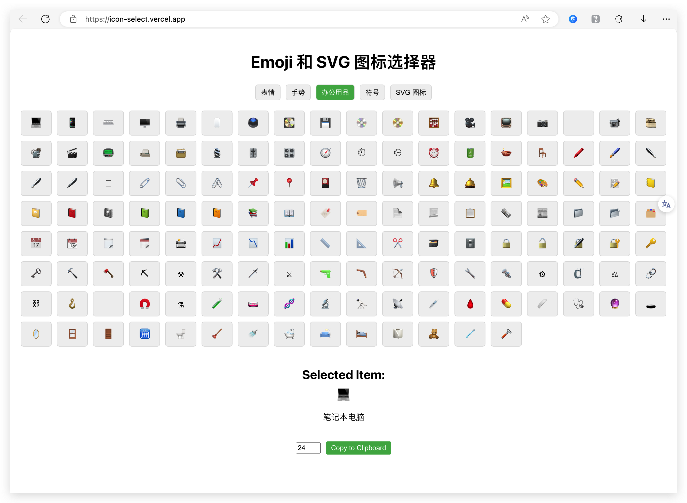

# Emoji 选择器应用

这是一个简单的 Emoji 和 SVG 图标选择器应用，允许用户浏览、选择和复制各种表情符号和图标。

## 特性

- 浏览不同类别的 Emoji 和 SVG 图标
- 选择 Emoji 或 SVG 图标并查看详细信息
- 复制所选图标到剪贴板
- 自定义 SVG 图标的大小

## 技术栈

- React
- JavaScript
- CSS

## 安装

1. 克隆这个仓库：

   ```bash
   git clone https://github.com/yourusername/emoji-selector.git
   ```

2. 进入项目目录：

   ```bash
   cd emoji-selector
   ```

3. 安装依赖：

   ```bash
   npm install
   ```

## 使用

1. 启动开发服务器：

   ```bash
   npm start
   ```

2. 打开浏览器并访问 `http://localhost:3000`。

## 部署

您可以使用 Vercel 部署此应用。请按照以下步骤进行操作：

1. 确保您已安装 Vercel CLI。如果没有，请运行以下命令：

   ```bash
   npm install -g vercel
   ```

2. 在项目目录中运行 Vercel 命令：

   ```bash
   vercel
   ```

3. 按照提示进行操作，您的应用将被部署到 Vercel。

可以直接访问 `Vercel` 部署示例 [https://icon-select.vercel.app/](https://icon-select.vercel.app/)

<!-- SNAPSHOT -->


## 目录结构

```text
emoji-selector/
├── public/
│ ├── index.html
│ └── favicon.ico
├── src/
│ ├── components/
│ │ └── EmojiSelector.jsx
│ ├── App.js
│ ├── index.js
│ └── styles.css
└── package.json
```

## 贡献

欢迎任何形式的贡献！请遵循以下步骤：

1. Fork 这个仓库
2. 创建您的特性分支 (`git checkout -b feature/YourFeature`)
3. 提交您的更改 (`git commit -m 'Add some feature'`)
4. 推送到分支 (`git push origin feature/YourFeature`)
5. 创建一个新的 Pull Request

## 许可证

该项目使用 MIT 许可证。

MIT 许可证的详细信息可以在 [MIT License](https://opensource.org/licenses/MIT) 找到。

## GitHub 仓库

您可以在这里找到项目的 GitHub 仓库：  
[](https://github.com/tufeiping/emoji-select)